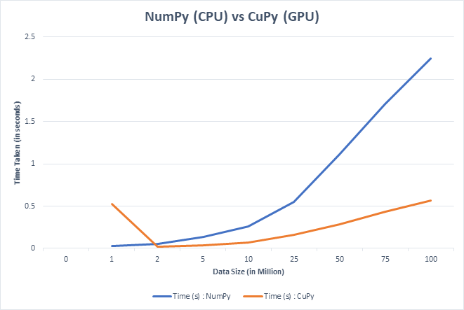

# Developing and Expanding CuPy library

Tanish Sharrma, NumFocus 2019

## Contact

| Name     | Tanish Sharrma                                         |
|----------|--------------------------------------------------------|
| Email    | tanishsharrma22@gmail.com                              |
| Mobile   | +91-7838063629 (WhatsApp as well)                      |
| LinkedIn | http://linkedIn.com/in/TanishSharrma                   |
| Github   | @TanishSharrma, https://github.com/TanishSharrma       |
| Resume   | http://tanish.ueuo.com/cv.pdf                          |

## INDEX

| S.No.    |                                         TOPIC                                        |
|----------|--------------------------------------------------------------------------------------|
|   1      | Abstract                                                                             |
|   2      | Brief Roadmap and Aim                                                                |
|   3      | CuPy : Pre-GSoc Project Commits, Pull Requests, Issues and Community Work            |
|   4      | Motivation and Personal Statement                                                    |
|   5      | Benchmark Experiment: NumPy (CPU) vs CuPy (GPU)                                      |
|   6      | Project Timeline and Details                                                         |
|   7      | Previous Projects and Work Experience                                                |
|   8      | Dataset Result of the benchmark experiment (S.No. 5)                                 |

## Abstract

CuPy is an open-source matrix library accelerated with NVIDIA CUDA. It also uses CUDA-related libraries including cuBLAS, cuDNN, cuRand, cuSolver, cuSPARSE, cuFFT and NCCL to make full use of the GPU architecture. Aiming to bring Numpy syntax coding into the modern age of GPU calculations by adding advanced FFT functions into CuPy.

| **Intensity** | **Involves**  | **Mentors** |
| ------------- | --------------|------------ |
| Intermediate  | Python, NumPy |   @asi1024  |
|               | SciPy & CUDA  |             |
                  
## Brief Roadmap and Aim

Expand the number of functions available for use on the GPU to allow more code to execute transparently on the GPU. Also, CuPy covers many of the functions that are provided by Numpy, but not all of them. To review the Numpy functions that CuPy doesn't cover yet, and implement them in CuPy to use the full speed of the GPU.

Adding SciPy functions along with adding new Statistical functionalities to the project.

To Formalize CuPy Benchmark for code testing, when doing Continuous Integration testing for CuPy, there isn't a good estimator for the speed of the code. CuPy is all about improved speed of calculation on the GPU, so speed matters. Develop a comprehensive benchmark for CuPy to help assess how much speed enhancements help, and make sure that other code changes don't damage performance.

## CuPy: Pre-GSoc Project Commits, Pull Requests and Issues and Community Work

### 1) Pull Request and commit : Added a new feature and resolved for Issue #2107 : bincount - Complex Weights :
       - https://github.com/cupy/cupy/pull/2139 
       - https://github.com/cupy/cupy/issues/2107

Issue #2107 (brought up by another use) :
"bincount is a useful way to average values in an array with variable length bins (another is np.add.at, but that is not implemented here). This is also described in the numpy.bincount manual (https://docs.scipy.org/doc/numpy/reference/generated/numpy.bincount.html).
However, if I give a complex64 array as the weights parameter, cupy.bincount fails with a NVRTCError/CompileException:"

**Resolved :**

Added a feature in "cupy.bincount" which will now be able to calculate even if the weights parameter is an array of complex         numbers (taken into account that not all values may be complex, hence setting a x+0j value to integer/float values). The calculation would be to do bincount twice (with real/imaginary part of the weight) [as suggested by "@kmaehashi"]

### 2) Submitted an Issue : CuPy not accepting list data types for operations #2138
       - https://github.com/cupy/cupy/issues/2138

For any function on a list(array) data type, Cupy gives an error unless the array has been defined as a cupy.array(). In, numpy however, the list data type is accepted regardless of it being passed as numpy.array() or not.

a = [10,15]
b = cupy.log(a)

This won't work in Cupy but will work in Numpy. a = cupy.array([10,15]) would work.
TypeError: Unsupported type <class 'list'>
This could cause problems for people shifting from Numpy to Cupy.

### 3) Resolve Suggested
       - https://github.com/cupy/cupy/issues/2137

Suggested a resolve for an installation Issue by downloading the Microsoft Visual C++ Build Tools for installation of CuPy in Windows.

## Motivation and Personal Statement

I am currently pursuing a degree in Statistics (Mathematics) and Computers and have always found it fascinating and exciting to implement Statistical and Machine Learning tools and models to Computers. I believe that Google Summer of Code is the perfect opportunity for me to practically apply my knowledge and skills in a useful environment. CuPy offers the future of GPU computing by providing a faster alternative to the most used Python library (CPU Based); NumPy.

I have been programming for over 12 years and have Machine Learning, Artificial Intelligence and CUDA experience as well. I have attended various conferences on GPU computing and am aware of the enormous potential it has. This summer, I will solely be focusing on Google Summer of Code and have no other commitments.

Ever since the true potential of GPU Computing has been observed, it has been seen that Next Generations of Servers seeming to replace the CPUs with faster, cost efficient, space- efficient performance it's impact on the future of Deep Learning and Artificial Intelligence. It's effect on Data Science and Big Data promises huge potential as well.  A short experiment to benchmark performance of NumPy vs CuPy and this is one of the driving factors that motivated me to join this project:

## Benchmark Experiment

10 experiments were conducted by me by taking large random numbers (between 1 and 100 million) from a Random Distribution, obtaining their natural logarithm and then calculating the mean of those results. The average time taken per million values over the course of these 10 experiments has been depicted. The test results (Data Set) has been provided at the end of this proposal, after the graph demonstrating the advantages of CuPy :

Specifications:

This experiment was conducted on a computer with the following hardware :

  -  CPU : Ryzen 5 2400G (2018 Model)
  -  RAM : 16 GB DDR4, 3000 Mhz
  -  GPU : GTX 1050ti 4 GB GDDR5 (CUDA GPU Computing power 6.0)

## Timeline

### **Community Bonding Period** : May 6th - May 27th 

Before the official time period begins, I plan to further study about the architecture and structure of the CuPy library and its hardware aspect. During this period, under my mentor, I plan to :

    - Add NumPy functionalities to CuPy
    
    - Help develop a NumPy fallback function for the functions and modules currently absent from CuPy. 
    
    - Solve issues and bugs being brought up by the members of the community.
    
    - Learn more about the long term goals for the CuPy project.
    
    - Create an environment which makes it easier for future developers to join this project.
    
    - Set up a blog and write weekly about the progress done.
    

### Phase 1 : May 27th - June 24th
	
    - Adding Missing Numpy functionalities
    
    - Introducing SciPy functionalities
    
    - Developing a fallback model for missing NumPy modules and functions
    
    - Rigorously testing and comparing code to make it easier for NumPy users to port of CuPy
    
    - Fixing bugs and Issues that come up with adding NumPy functionalities.
    

### Phase 2 : June 28th - July 22nd
	
    - Adding Statistical tools to the Cupy Library.
    
    - Developing "Statistical Inference" tools and functions for bias and estimator inference.
    
    - Adding Sampling modules along with Population and Survey Sampling techniques and tools.
    
    - Making the transitioning from CPU based to GPU based more efficient and easier.
    
    - Developing tools for t-test, f-test and Ho statistics.

### Phase 3 : July 26th - August 19th

    - Introducing Machine Learning models (mainly related to Mathematics and Statistcis) to the CuPy library and ensure its stability.
    
    - Developing Regression analysis tools (for Linear, Bivatriate and Multivariate analysis)
    
    - Providing tools for the development of Linear Models and determining the BLUE (Best Linear Unbiast Estimator for both non- full rank and full rank cases)
    
    - Calculation of ANOVA Tables and determining of Confidence Interval / Limits for the provided data.
        

### Future works (After GSoc)

- In future, I plan to work on Game Theory applications' integration to CuPy (Axelrod Python library)

## Other Projects and Work Experience

I have undertaken two technical internships, one as a Software Engineer and one as a Data Science Researcher. I have been programming and developing complex Algorithms in Python and Java for a few years now and since 2017, have started undertaking projects in the field of Data Science, Machine Learning and Artificial Intelligence. During my Summer Internship in the previous year (As a Data Science Intern), I gained tremendous amount of experience and exposure and learned to implement my knowledge in a practical field. 

I am eager to learn and have worked on several Machine Learning and Artificial Intelligence projects as well. Namely, Image Classifier using Convolutional Neural Network (CNN), Machine Learning models for datasets provided on Kaggle, Basics of CUDA and GPU Computing etc.

I have undertaken substantial number of Mathematics and Computing classes and am ready to have first hand experience tackling real life issues with CuPy. Details of everything aforementioned are in my Resume : http://tanish.ueuo.com/cv.pdf

## Benchmark Experiment Raw Data

Data Size (in Million)	NumPy	CuPy
		
1	0.033001184	0.566046238
2	0.080005407	0.01743865
5	0.206018448	0.039004087
10	0.295022726	0.073099852
25	0.554044485	0.169439793
50	1.098106384	0.283161163
75	1.665119648	0.425621986
100	2.23718524	0.566138744
		
1	0.028001547	0.52785635
2	0.058004856	0.017000914
5	0.155011892	0.041003704
10	0.307024956	0.073003054
25	0.57106328	0.173015356
50	1.102072477	0.296225786
75	1.736142635	0.434362888
100	2.263186693	0.574162006
		
1	0.022001266	0.55436945
2	0.046004057	0.015001297
5	0.110008717	0.036002874
10	0.220018387	0.062647104
25	0.554045439	0.149012804
50	1.093089819	0.274021387
75	1.695138216	0.432865858
100	2.27818656	0.57603097
		
1	0.031001329	0.549311638
2	0.071005583	0.015000343
5	0.231019258	0.033616543
10	0.466037512	0.06113863
25	0.562045097	0.153815746
50	1.077087402	0.277036905
75	1.709139585	0.424188137
100	2.199180841	0.565034628
		
1	0.036002636	0.50888133
2	0.065004349	0.014997959
5	0.126009703	0.033002138
10	0.217018366	0.062006712
25	0.537043095	0.150317192
50	1.078088522	0.274814367
75	1.628133059	0.432635069
100	2.258185863	0.563354969
		
1	0.027001858	0.500862837
2	0.050004244	0.017000914
5	0.11400938	0.039807558
10	0.218034267	0.076020718
25	0.558030128	0.169196606
50	1.273121357	0.289659023
75	1.965142965	0.427166462
100	2.29218626	0.570260525
		
1	0.021996021	0.544084787
2	0.049003124	0.016615152
5	0.111011505	0.036003828
10	0.221015453	0.065004587
25	0.548044205	0.150896788
50	1.091088772	0.271864176
75	1.660151243	0.427860975
100	2.300172806	0.56648159
		
1	0.025002241	0.512556791
2	0.047003746	0.018000603
5	0.10702467	0.0400033
10	0.218000412	0.073000908
25	0.543044329	0.170437336
50	1.084089518	0.297247648
75	1.661135197	0.432933569
100	2.209177256	0.559125185
		
1	0.02200222	0.484235764
2	0.044002771	0.015683651
5	0.109008789	0.035800934
10	0.240019321	0.064005375
25	0.547044754	0.150373697
50	1.099090815	0.278987885
75	1.678136826	0.428530693
100	2.221181393	0.562766314
		
1	0.022002697	0.534286261
2	0.045002699	0.016898632
5	0.109009266	0.0392313
10	0.219034195	0.0752635
25	0.543027163	0.164491415
50	1.091090202	0.280375957
75	1.670138121	0.434535027
100 2.197177887 0.564449072
